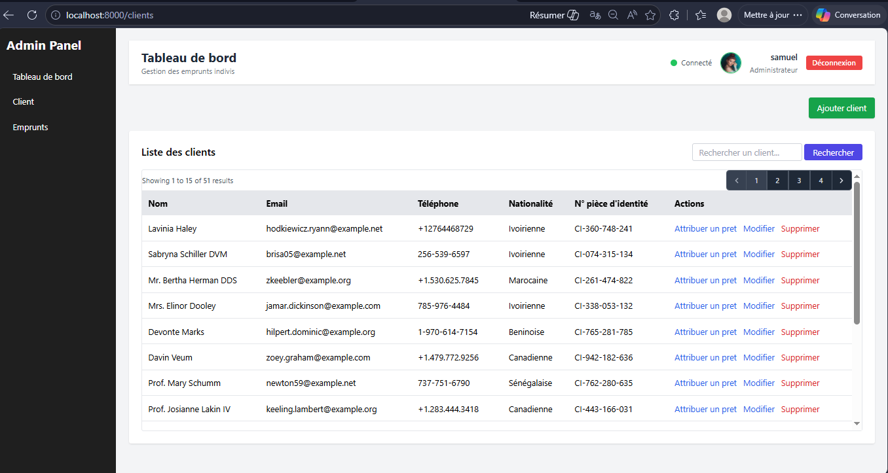
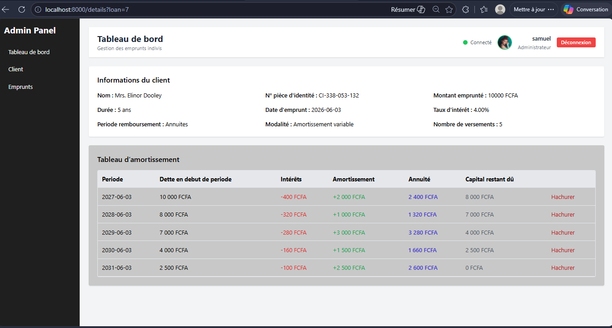
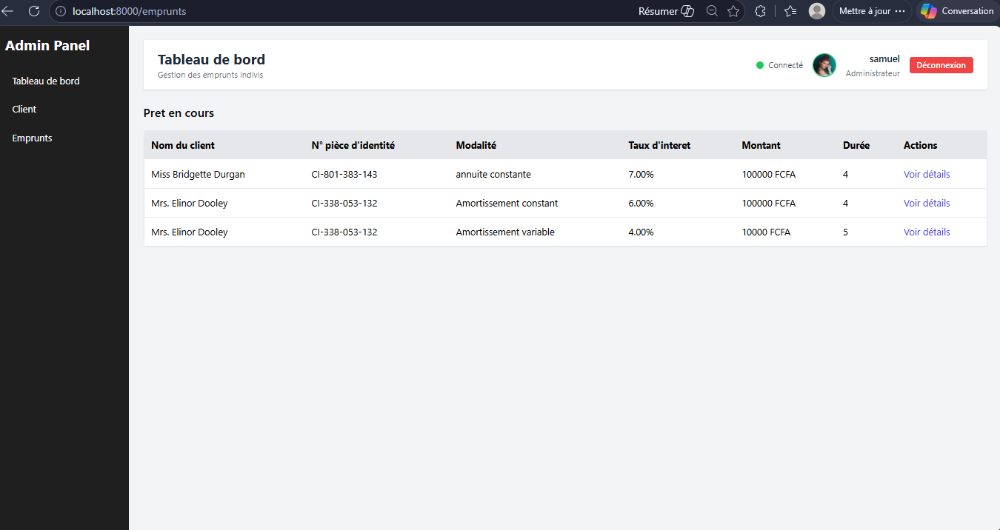
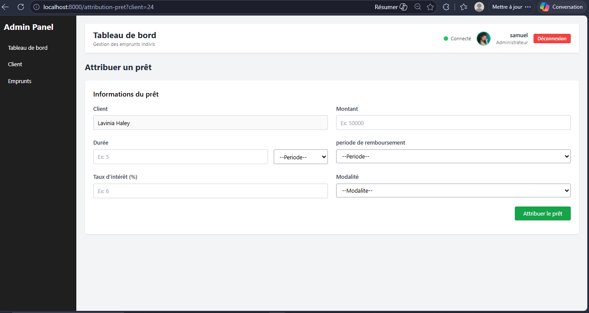
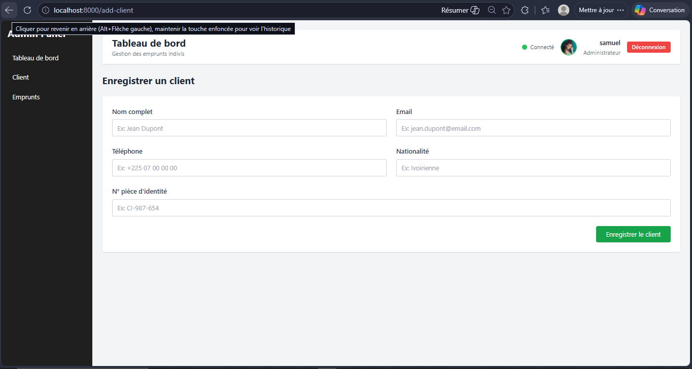

# Gestion des empruns indivis
Lorsque l'on parle d'empruns indivis, on fait allusion à des empruns banquaires effectués par des individus.
Alors lorsque l'on parle d'empruns banquaire, beaucoup de choses sont prises en compte. Je veux parler des interêts, les annuités, et j'en passe...., dont l'emprunteur n'a pas vraiment bonne comprehension. 
Alors c'est là qu'intervient ce site, qui permet non seulememt aux organisations d'attribuer des prêts, mais aussi aux empreunteurs de connaitre tous les details liés au mode de rembousement.

## Fonctionnalités
- Authentification
- Gestion des clients(empreunteurs)
- Gestion des prêts accordés
- Gestion du tableau d'amortissement et du delais de remboursement selon le mode choisi par le client 
- Tableau de bord 

## Technologies
- Html
- css
- javascript
- laravel
- Docker

## Aperçu

